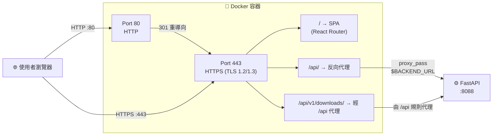

# Defense-Bot Frontend (口試佈告管家 - 前端)

一個簡潔高效的口試佈告生成工具前端。學生只需登入、進入對話區，告訴 AI 你的口試地點、時間和委員名單，就能一鍵下載排版精美的 PowerPoint 佈告。

**核心特色：**
- 🔐 **無狀態驗證**：只需學號，無需密碼；後端進行零信任驗證
- 💬 **智能對話**：與 Dify AI Agent 多輪互動，自動對話狀態保持
- 📥 **一鍵下載**：AI 生成 PPT 檔案後，點擊即可下載
- 🔒 **全程加密**：HTTPS 全站加密，安全標頭完整覆蓋
- 🐳 **一鍵部署**：Docker 容器化，無需本地 Node.js 環境

---

## 技術棧 (Tech Stack)

| 類別 | 技術 |
|------|------|
| **核心框架** | React 19 + Vite 7 |
| **路由管理** | React Router DOM v7 |
| **樣式排版** | Tailwind CSS 3 (PostCSS + Autoprefixer) |
| **容器化部署** | Docker (Multi-Stage Build) + Nginx (Alpine) |
| **傳輸安全** | HTTPS (TLS 1.2 / 1.3)，HTTP→HTTPS 強制重導向 |
| **安全標頭** | HSTS, X-Frame-Options, X-Content-Type-Options, Referrer-Policy |

---

## 功能總覽 (Features)

本前端遵循 **「簡身體、全驗證、零信任」** 的設計原則：前端只負責 UI 渲染與使用者交互，所有身分驗證與業務邏輯由後端 FastAPI 負責，確保安全性與可維護性。

### 🔑 登入頁面 (`/` → Login.jsx)
- 輸入學號驗證身分（無需密碼）
- 學號與姓名儲存至瀏覽器 `localStorage`，作為後續 API 請求的身份憑證
- 若已登入，自動跳轉至儀表板；登入狀態過期會自動要求重新驗證

### 📊 個人儀表板 (`/dashboard` → Dashboard.jsx)
- **個人資訊卡片**：呼叫 `GET /api/v1/students/me` 顯示學生姓名、論文題目、指導教授
- **歷史紀錄列表**：呼叫 `GET /api/v1/defense/history` 列出曾生成的口試佈告記錄，每筆包含日期、地點、狀態與下載連結
- **快速操作**：可一鍵進入對話區生成新佈告，或登出清除身份驗證

### 💬 AI 對話互動區 (`/chat` → ChatRoom.jsx)
- **個人化開場**：自動帶入學生姓名，提示輸入口試地點、時間、委員名單
- **多輪對話**：與後端 Dify AI Agent 串接 (`POST /api/v1/chat`)，透過 `conversation_id` 維持多輪對話狀態
  - 前端只傳遞學號（Header 中的 `x-student-id`）與查詢文本，後端自動以零信任模式驗證身分、拉取學生資料
- **智能下載卡片**：自動偵測 AI 回覆中的 `[DOWNLOAD](*.pptx)` 或 `.pptx` 連結，轉換為點擊下載的藍色卡片按鈕
- **即時回饋**：載入中顯示動畫，自動捲動至最新訊息，網路中斷時提示錯誤
- **安全退出**：登入狀態過期（401 Unauthorized）自動提示重新登入

---

## 設計原則 (Design Principles)

### ✅ 前端職責
- **UI 渲染與交互**：登入、儀表板、對話介面
- **狀態管理**：學號和姓名存儲至 `localStorage`
- **API 請求**：在 Header 中攜帶 `x-student-id` 進行身份識別
- **下載卡片**：自動偵測 AI 回覆中的 PPT 連結並轉換為互動按鈕

### ❌ 前端不負責（由後端在零信任模式下驗證）
- ✋ **身份驗證**：後端收到 `x-student-id` 時會查資料庫驗證合法性
- ✋ **資料隔離**：後端確保學生只能看到自己的資訊與歷史紀錄
- ✋ **AI 邏輯**：與 Dify Agent 交互、生成 PPT 皆由後端負責

### 🔐 安全性設計
- **HTTPS 全站加密**：Dockerfile 自動產生自簽憑證（測試環境），Nginx 強制 HTTP→HTTPS 重導向
- **安全標頭**：HSTS（兩年有效期）、防 Clickjacking (X-Frame-Options DENY)、防 MIME 嗅探、Referrer 控制
- **反向代理**：Nginx 統一轉發 `/api/` 至後端（含 `/api/v1/downloads/*` 認證下載），前端使用相對路徑，無跨域問題
- **無狀態驗證**：不存儲密碼，只用學號作為標識符，後端進行零信任驗證

---

## 部署與啟動 (Deployment)

本專案已全面導入 Docker 容器化與腳本自動化部署。您不需要在本地安裝 Node.js，只要有 Docker 環境即可一鍵架設完畢。

### 📋 環境要求
請確保您的部署機器已安裝 [Docker](https://docs.docker.com/get-docker/)。

### 🚀 一鍵啟動 (推薦)
請在終端機進入專案根目錄，並執行啟動腳本：

```bash
# 1. 賦予腳本執行權限 (初次執行需要)
chmod +x run.sh

# 2. 執行一鍵啟動
./run.sh
```

### 💡 `run.sh` 幕後做的事
1. ✅ 檢查 Docker 是否已安裝
2. ✅ 檢查 `.env` 檔案，若無自動複製 `.env.example` 並提醒修改 `BACKEND_URL`
3. ✅ 驗證 `BACKEND_URL` 不為預設佔位值，避免誤部署
4. ✅ 清理舊容器（若存在）
5. ✅ 執行多階段 Docker 構建（Node 編譯 → 自簽憑證 → Nginx 配置）
6. ✅ 啟動容器並映射 Port 80 (HTTP) 與 443 (HTTPS)
7. ✅ 設定 `--restart unless-stopped`，確保機器重啟後服務自動恢復

### 🌐 存取前端
```
🔗 HTTPS：https://<FRONTEND_HOST_OR_IP>
🔄 HTTP：自動重導向至 HTTPS
⚠️  安全警告：測試環境使用自簽憑證，瀏覽器會顯示警告，點選「繼續」或「接受風險」即可
```

### ⚙️ 環境變數設定 (Environment Variables)
若後端 API 的 IP 或網域有變動，請修改專案根目錄下的 `.env` 檔案：

```env
# 後端 API 的基礎網址（填入後端宿主機的真實 IP 與 Port）
# ⚠️ 不可使用 127.0.0.1：容器內 127.0.0.1 只指向容器本身，無法到達後端
# 範例：http://<BACKEND_HOST_OR_IP>:8088（本地 IP）或 https://<BACKEND_PUBLIC_DOMAIN_OR_IP>（對外位址）
BACKEND_URL=http://<BACKEND_HOST_OR_IP>:8088
```

修改後，再次執行 `./run.sh` 即可套用新設定。

### 📊 常用管理指令
```bash
# 查看即時日誌（按 Ctrl+C 退出）
docker logs -f defense-bot-frontend

# 停止並移除容器
docker rm -f defense-bot-frontend

# 檢查容器狀態
docker ps -a | grep defense-bot-frontend
```

---

## 本地開發 (Development)

若您想在本地機器上開發或測試，請先安裝 Node.js 環境，然後按照以下步驟：

### 📦 安裝依賴
```bash
npm install
```

### 🔧 環境設定
複製環境變數範本並填入後端 API 位置：
```bash
cp .env.example .env
# 編輯 .env，設定 VITE_API_BASE_URL 為後端 API 位置
# 範例：VITE_API_BASE_URL=http://localhost:8088
```

### 🚀 啟動開發伺服器
```bash
npm run dev
```
預設在 `http://localhost:5173` 啟動，支援熱重載（修改程式碼自動刷新）。

### 🔨 生產環境構建
```bash
npm run build
```
會在 `dist/` 目錄下生成最小化的靜態檔案，稍後由 Nginx 提供服務。

### 📝 程式碼語法檢查
```bash
npm run lint
```

---

## 目錄結構說明 (Folder Structure)

```text
defense-bot-frontend/
├── public/               # 靜態資源 (如 favicon.ico)
├── src/
│   ├── assets/           # 圖片、SVG 等內部資源
│   ├── pages/            # 系統核心頁面
│   │   ├── Login.jsx     # 登入與身分綁定頁面 (學號驗證 → localStorage)
│   │   ├── Dashboard.jsx # 個人儀表板 (個人資訊卡片 + 歷史連結列表 + 登出)
│   │   └── ChatRoom.jsx  # AI 對話互動區 (多輪對話 + 下載卡片渲染)
│   ├── App.jsx           # 前端路由設定 (/ → /dashboard → /chat)
│   ├── main.jsx          # React 應用程式進入點 (StrictMode)
│   └── index.css         # Tailwind 基礎樣式 (@tailwind directives)
├── .env.example          # 環境變數範本檔 
├── .dockerignore         # Docker 構建忽略清單 (node_modules, dist, .env)
├── Dockerfile            # 多階段構建 (Node 編譯 → 自簽憑證 → Nginx 部署)
├── nginx.conf            # Nginx 設定模板 (HTTPS + 安全標頭 + 反向代理 + SPA 路由)
├── run.sh                # 一鍵 Docker 啟動腳本 (含環境檢查與容器管理)
├── tailwind.config.js    # Tailwind CSS 樣式配置檔
├── vite.config.js        # Vite 構建配置檔
└── package.json          # 專案依賴套件清單
```

---

## API 規格與開發指南 (API Documentation)

本系統採取**「簡身體、全驗證、零信任」**的設計模式。前端只需負責 UI 渲染與使用者交互，所有身分驗證與業務邏輯由後端 FastAPI 負責。

### 📚 完整 API 文件
所有 API 端點的詳細規格、請求格式、回傳值，請參考後端自動生成的互動式 API 文件：
👉 **[http://<BACKEND_HOST_OR_IP>:8088/docs](http://<BACKEND_HOST_OR_IP>:8088/docs)**（或 `https://<BACKEND_PUBLIC_DOMAIN_OR_IP>/docs`）

### 核心 API 速查表

| 方法 | 端點 | 用途 |
|------|------|------|
| `GET` | `/api/v1/students/me` | 取得登入學生的基本資料（姓名、論文題目、指導教授） |
| `GET` | `/api/v1/defense/history` | 取得該學生過去生成的口試佈告歷史紀錄與下載連結 |
| `POST` | `/api/v1/chat` | 傳送對話訊息至 Dify AI Agent（攜帶 `query` 與 `conversation_id`） |

### 🔐 身份驗證規範

所有 API 請求都必須在 HTTP Header 中攜帶 `x-student-id`，後端會據此進行身分驗證與資料隔離。

**前端程式碼範例：**
```javascript
const studentId = localStorage.getItem('studentId');
const headers = {
  'Content-Type': 'application/json',
  'x-student-id': studentId  // 必填：後端用此驗證學生身分
};

fetch('/api/v1/chat', {
  method: 'POST',
  headers: headers,
  body: JSON.stringify({
    query: '我的口試時間是今天下午 2 點',
    conversation_id: conversationId  // 多輪對話用
  })
});
```

**重點：**
- ✅ **不需貼密碼**：後端不進行密碼驗證，只會核對 `x-student-id` 是否存在於資料庫
- ✅ **自動資料隔離**：後端確保登入的學生只能讀寫自己的資料
- ❌ **不要在 URL 或 Body 中貼學號**：學號只應在 Header 中傳遞


---

## 路由結構 (Routes)

| 路徑 | 頁面元件 | 說明 |
|------|----------|------|
| `/` | `Login` | 登入頁面，輸入學號驗證身分 |
| `/dashboard` | `Dashboard` | 個人儀表板，顯示資訊與歷史紀錄 |
| `/chat` | `ChatRoom` | AI 對話互動區，生成口試佈告 |

---

## Nginx 反向代理與安全配置



* **HTTP→HTTPS 重導向**：Port 80 收到的所有請求自動 301 重導向至 HTTPS (Port 443)。
* **TLS 配置**：僅允許 TLS 1.2 / 1.3，禁用過時的 SSLv3、TLS 1.0、TLS 1.1。
* **SPA 路由**：所有未匹配的路徑 fallback 至 `index.html`，由 React Router 處理。
* **反向代理**：`/api/*` 請求轉發至 `BACKEND_URL`（由 `.env` 注入，含 `/api/v1/downloads/*`），附帶 `X-Real-IP`、`X-Forwarded-For`、`X-Forwarded-Proto` 標頭。

### 4. 特殊 UI 渲染邏輯 (檔案下載卡片)
前端會攔截 `ChatRoom.jsx` 中 AI 回傳的文字串流。若透過正則表達式偵測到特定格式的 Markdown 下載連結（例如 `[DOWNLOAD](http://.../xxx.pptx)`），前端會隱藏原本的 Markdown 語法，將該段落轉換為排版精美的「📥 點我下載 PPT」互動卡片按鈕。

---

## 故障排除 (Troubleshooting)

### ❌ 登入時「無法連接到伺服器」
**原因：** 前端無法連接到後端 API。

**解決方案：**
1. 確認後端 FastAPI 已啟動：
   ```bash
  curl http://<BACKEND_HOST_OR_IP>:8088/docs
   ```
2. 檢查 `.env` 中的 `BACKEND_URL` 是否正確
   - ⚠️ 不可使用 `127.0.0.1`（Docker 容器內無法到達宿主機）
   - 應使用實際 IP，例如 `http://192.168.1.100:8088`
3. 確認防火牆未阻擋 8088 Port
4. 清除瀏覽器快取並重新整理

### ❌ SSL/TLS 安全警告
**原因：** 測試環境使用自簽憑證。

**解決方案：** 直接點選「繼續」或「接受風險」，這是正常現象。生產環境應使用正式憑證。

### ❌ 登入成功但無法看到個人資訊
**原因：** 學號不存在於資料庫，或後端未正常返回資料。

**解決方案：**
1. 查看後端日誌：`docker logs defense-bot-backend`
2. 確認輸入的學號是否存在
3. 清除 `localStorage` 重新登入（瀏覽器開發者工具 → Application → Local Storage → 清除）

### ❌ AI 對話提示 401 Unauthorized
**原因：** 前端未在 Header 中附帶 `x-student-id`，或學號過期。

**解決方案：**
1. 重新登入
2. 檢查 `localStorage` 是否仍有 `studentId`
3. 查看後端日誌確認驗證流程

### ❌ 點擊下載但檔案未下載
**原因：** 網路中斷、PPT 生成中，或連結解析錯誤。

**解決方案：**
1. 等待 AI 完整回覆（應出現「📥 點此下載 PPT」按鈕）
2. 檢查瀏覽器下載管理器
3. 查看後端日誌確認 PPT 是否已生成
4. 從歷史紀錄重新下載

### ❌ Docker 容器無法啟動
**原因：** Port 被佔用或環境設定錯誤。

**解決方案：**
```bash
# 檢查 Port 使用狀況
sudo lsof -i :80
sudo lsof -i :443

# 查看容器日誌
docker logs defense-bot-frontend
```

---

## 常見問題 (FAQ)

**Q: 為什麼前端不存儲密碼？**
A: 設計特點。前端只需學號，後端進行零信任驗證。更安全、更簡潔。

**Q: 我可以在多個瀏覽器同時登入嗎？**
A: 可以。每個瀏覽器的 `localStorage` 獨立，無 Session 群體限制。

**Q: 清除瀏覽器資料後登入資訊會消失嗎？**
A: 會。登入資訊存在 `localStorage`，清除快取時會被刪除，需重新登入。

**Q: AI 生成 PPT 需要多長時間？**
A: 通常 5-30 秒，取決於 Dify Agent 處理速度。超過 1 分鐘請查看後端日誌。

**Q: 舊的口試佈告會永久保存嗎？**
A: 是的。所有歷史紀錄存儲於後端資料庫，可隨時於儀表板重新下載。

---
