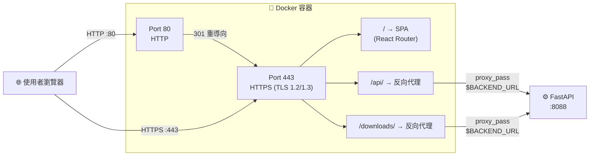

# Defense-Bot Frontend (口試佈告管家 - 前端)

這是一個基於 React + Vite 開發的智慧口試佈告生成系統前端。透過對話式介面 (Chat UI)，引導學生輸入口試地點、時間與委員名單，並與後端 AI Agent (Dify) 進行串接，最終一鍵生成排版精美的口試佈告 PowerPoint (PPTX)。

---

## 技術棧 (Tech Stack)

| 類別 | 技術 |
|------|------|
| **核心框架** | React 19 + Vite 7 |
| **路由管理** | React Router DOM v7 |
| **樣式排版** | Tailwind CSS 3 (PostCSS + Autoprefixer) |
| **容器化部署** | Docker (Multi-Stage Build) + Nginx (Alpine) |
| **傳輸安全** | HTTPS (TLS 1.2 / 1.3)，HTTP→HTTPS 強制重導向 |
| **安全標頭** | HSTS, X-Frame-Options, X-Content-Type-Options, Referrer-Policy |

---

## 功能總覽 (Features)

### 頁面一：登入頁 (`/` → Login.jsx)
* 輸入學號以核對身份，學號儲存至 `localStorage` 作為後續 API 憑證。
* 驗證通過後自動導向個人儀表板 `/dashboard`。

### 頁面二：個人儀表板 (`/dashboard` → Dashboard.jsx)
* **個人資訊卡片**：呼叫 `GET /api/v1/students/me` 顯示學生姓名、論文題目、指導教授。
* **歷史產出列表**：呼叫 `GET /api/v1/defense/history` 列出過去生成的口試佈告，每筆紀錄含口試日期、地點與「下載 PPT」按鈕。
* **產生新佈告**：點擊按鈕導向 `/chat` 進入 AI 對話互動區。
* **登出功能**：清除 `localStorage` 並返回登入頁。

### 頁面三：AI 對話互動區 (`/chat` → ChatRoom.jsx)
* **個人化開場白**：自動帶入學生姓名，提示輸入口試地點、時間與委員名單。
* **即時對話介面**：與後端 Dify AI Agent 串接 (`POST /api/v1/chat`)，支援 `conversation_id` 多輪對話狀態維持。
* **下載卡片渲染**：AI 回覆包含 `[DOWNLOAD](*.pptx)` 或 `.pptx` 連結時，自動解析並渲染為精美的下載卡片 UI，點擊即可下載 PPT。
* **載入動畫**：訊息發送後顯示「管家正在排版中，請稍候...」脈衝動畫。
* **自動捲動**：新訊息出現時自動捲動至底部。
* **錯誤處理**：偵測 HTTP 401 自動提示重新登入；連線中斷時顯示系統提示。
* **返回儀表板**：頂部導航列可一鍵返回 Dashboard。

### 安全性與部署
* **HTTPS 全站加密**：Dockerfile 自動產生自簽憑證（測試環境），Nginx 強制 HTTP→HTTPS 重導向。
* **安全標頭**：HSTS（兩年有效期）、防 Clickjacking (X-Frame-Options DENY)、防 MIME 嗅探、Referrer 控制。
* **反向代理**：Nginx 統一轉發 `/api/` 與 `/downloads/` 至後端，前端使用相對路徑，無跨域問題。
* **容器自動重啟**：`--restart unless-stopped` 策略確保服務持續運行。

---

## 一鍵部署與啟動 (One-Click Deployment)

本專案已全面導入 Docker 容器化與腳本自動化部署。您不需要在本地安裝 Node.js，只要有 Docker 環境即可一鍵架設完畢。

### 1. 環境要求
請確保您的部署機器（或測試 VM）已安裝 [Docker](https://docs.docker.com/get-docker/)。

### 2. 一鍵啟動 (推薦)
請在終端機進入專案根目錄，並執行啟動腳本：

```bash
# 1. 賦予腳本執行權限 (初次執行需要)
chmod +x run.sh

# 2. 執行一鍵啟動
./run.sh
```

**💡 `run.sh` 腳本在背後做了什麼？**
1. 自動檢查 Docker 是否已安裝，若未安裝會提示並中止。
2. 自動檢查是否有 `.env` 檔案，若無則複製 `.env.example` 生成預設設定，並提醒您修改 `BACKEND_URL`。
3. 驗證 `.env` 中的 `BACKEND_URL` 不為預設佔位值 (`192.168.x.x`)，避免誤部署。
4. 若舊容器仍在運行，自動移除後重新部署。
5. 使用 `docker build` 進行多階段構建（Node 編譯 → 自簽憑證產生 → Nginx 部署）。
6. 以 `docker run` 啟動容器，映射 Port 80 (HTTP) 與 Port 443 (HTTPS)，HTTP 流量自動重導向至 HTTPS。
7. 容器設定 `--restart unless-stopped`，機器重啟後服務會自動恢復。

### 3. 存取方式
```
HTTPS 前端：https://<您的主機IP>
HTTP  自動重導向至 HTTPS
⚠️  測試環境使用自簽憑證，瀏覽器會顯示安全警告，點選「繼續」即可
```

### 4. 環境變數設定 (Environment Variables)
若後端 API 的 IP 或網域有變動，請修改專案根目錄下的 `.env` 檔案，修改後再次執行 `./run.sh` 即可套用新設定：

```env
# 後端 API 的基礎網址 (請填入後端宿主機的真實 IP 與 Port，不可使用 127.0.0.1)
# 127.0.0.1 在容器內只指向 Nginx 容器自身，無法到達後端
# Nginx 反向代理 /api/ 和 /downloads/ 時，會將請求轉送到此 URL
BACKEND_URL=http://192.168.x.x:8088
```

### 5. 常用管理指令
```bash
# 查看即時日誌
docker logs -f defense-bot-frontend

# 停止並移除容器
docker rm -f defense-bot-frontend
```

---

## 目錄結構說明 (Folder Structure)

```text
defense-bot-frontend/
├── public/               # 靜態資源 (如 favicon.ico)
├── src/
│   ├── assets/           # 圖片、SVG 等內部資源
│   ├── pages/            # 系統核心頁面
│   │   ├── Login.jsx     # 登入與身分綁定頁面 (學號驗證 → localStorage)
│   │   ├── Dashboard.jsx # 個人儀表板 (個人資訊卡片 + 歷史連結列表 + 登出)
│   │   └── ChatRoom.jsx  # AI 對話互動區 (多輪對話 + 下載卡片渲染)
│   ├── App.jsx           # 前端路由設定 (/ → /dashboard → /chat)
│   ├── main.jsx          # React 應用程式進入點 (StrictMode)
│   └── index.css         # Tailwind 基礎樣式 (@tailwind directives)
├── .env.example          # 環境變數範本檔 
├── .dockerignore         # Docker 構建忽略清單 (node_modules, dist, .env)
├── Dockerfile            # 多階段構建 (Node 編譯 → 自簽憑證 → Nginx 部署)
├── nginx.conf            # Nginx 設定模板 (HTTPS + 安全標頭 + 反向代理 + SPA 路由)
├── run.sh                # 一鍵 Docker 啟動腳本 (含環境檢查與容器管理)
├── tailwind.config.js    # Tailwind CSS 樣式配置檔
├── vite.config.js        # Vite 構建配置檔
└── package.json          # 專案依賴套件清單
```

---

## API 規格與開發指南 (API Documentation)

本系統採取**「輕量化狀態、零信任驗證」**的設計模式。前端只需負責介面渲染，核心業務邏輯與 AI 驗證皆由後端 FastAPI 處理。

### 1. API 文件參考 (Swagger UI)
所有 API 端點的詳細規格、請求格式 (Payload) 與回傳格式，請直接參考後端自動生成的互動式 API 文件：
👉 **http://[後端IP]:8088/docs**

### 2. 核心 API 列表
前端主要串接以下三支核心 API：

| 方法 | 端點 | 用途 |
|------|------|------|
| `GET` | `/api/v1/students/me` | 取得登入學生的基本資料（姓名、論文題目、指導教授） |
| `GET` | `/api/v1/defense/history` | 取得該學生過去生成的口試佈告歷史紀錄與下載連結 |
| `POST` | `/api/v1/chat` | 傳送對話訊息至 Dify AI Agent（攜帶 `query` 與 `conversation_id`） |

### 3. 全域身分驗證規範 (Authentication)
* **狀態儲存**：使用者登入後，前端會將學號 (`studentId`) 與姓名 (`student_name`) 存入瀏覽器的 `localStorage` 中。
* **Header 攔截**：後續**所有**與後端溝通的 API 請求，都必須在 HTTP Headers 中攜帶 `x-student-id`，供後端進行身分識別與資料隔離。
  ```javascript
  headers: { 
    'Content-Type': 'application/json',
    'x-student-id': localStorage.getItem('studentId')
  }
  ```

---

## 路由結構 (Routes)

| 路徑 | 頁面元件 | 說明 |
|------|----------|------|
| `/` | `Login` | 登入頁面，輸入學號驗證身分 |
| `/dashboard` | `Dashboard` | 個人儀表板，顯示資訊與歷史紀錄 |
| `/chat` | `ChatRoom` | AI 對話互動區，生成口試佈告 |

---

## Nginx 反向代理與安全配置



* **HTTP→HTTPS 重導向**：Port 80 收到的所有請求自動 301 重導向至 HTTPS (Port 443)。
* **TLS 配置**：僅允許 TLS 1.2 / 1.3，禁用過時的 SSLv3、TLS 1.0、TLS 1.1。
* **SPA 路由**：所有未匹配的路徑 fallback 至 `index.html`，由 React Router 處理。
* **反向代理**：`/api/*` 與 `/downloads/*` 請求轉發至 `BACKEND_URL`（由 `.env` 注入），附帶 `X-Real-IP`、`X-Forwarded-For`、`X-Forwarded-Proto` 標頭。

### 4. 特殊 UI 渲染邏輯 (檔案下載卡片)
前端會攔截 `ChatRoom.jsx` 中 AI 回傳的文字串流。若透過正則表達式偵測到特定格式的 Markdown 下載連結（例如 `[DOWNLOAD](http://.../xxx.pptx)`），前端會隱藏原本的 Markdown 語法，將該段落轉換為排版精美的「📥 點我下載 PPT」互動卡片按鈕。

---

